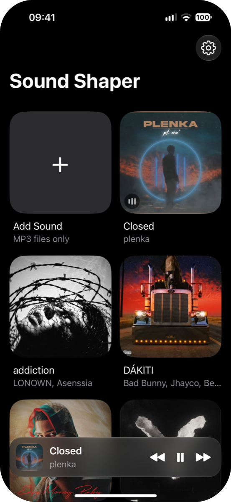
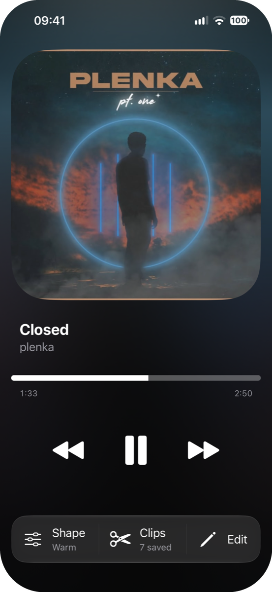
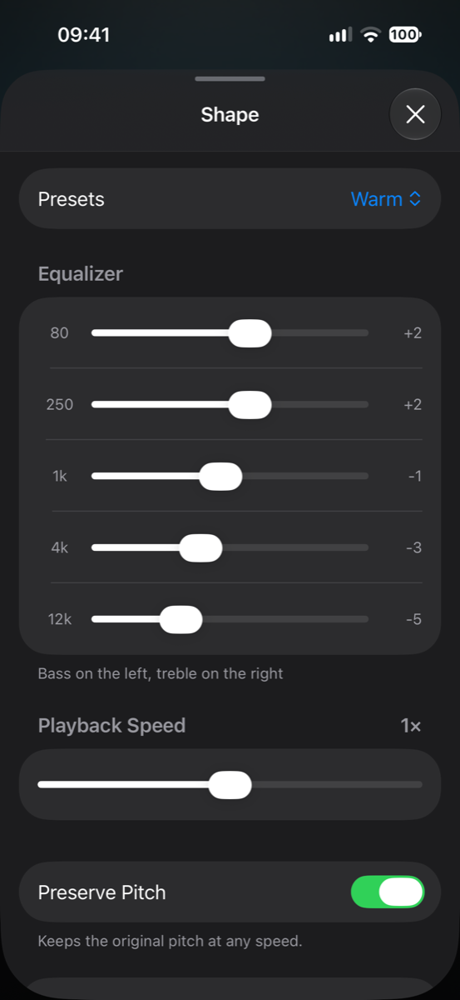
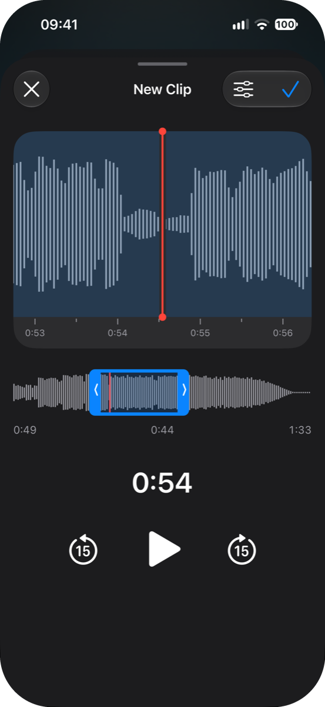
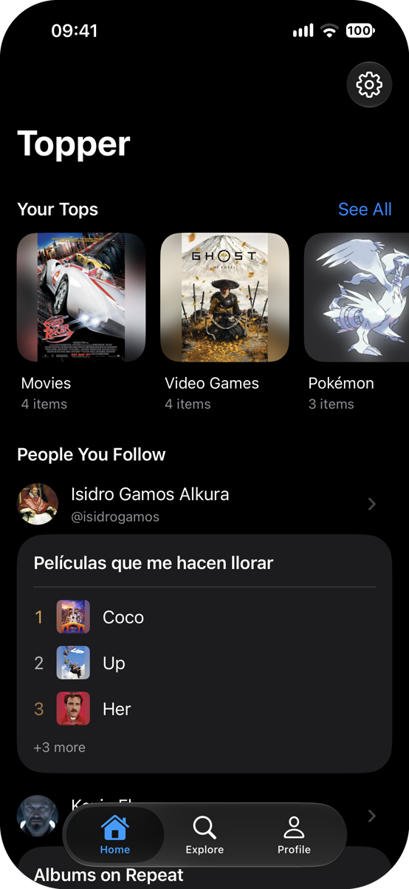
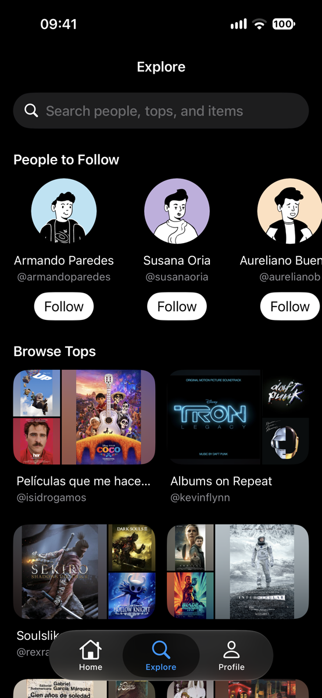
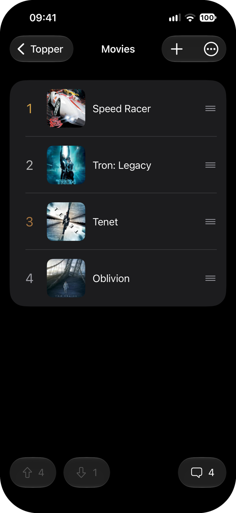
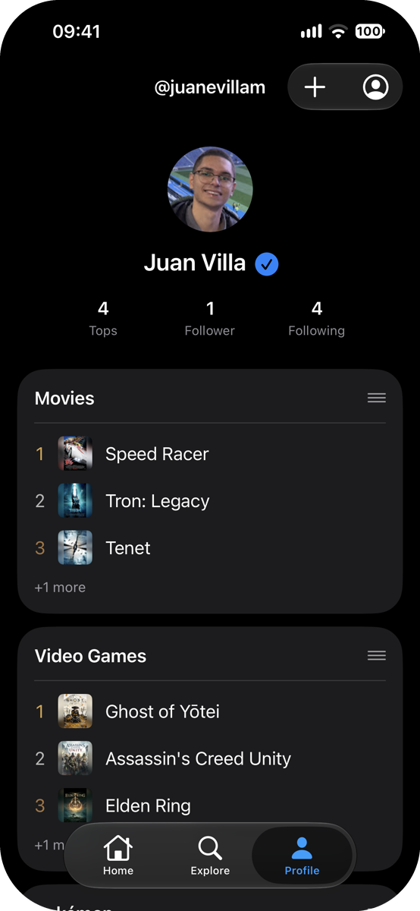

# Hi · Hola · 你好, I'm Juan Villa

**Software developer** from Venezuela. I build native mobile apps and web products, and I build them the way I play games: going for the platinum.

Since 2022 I've built web and mobile products at [Crol](https://www.crol.mx), a cloud ERP for small and mid-sized businesses in Mexico. On my own time I build my own apps.

## My apps

### Sound Shaper

A music player for your own MP3s, shaped the way you want them to sound.

- **Make every song yours.** Change the speed live, set a five-band equalizer or a preset, and add effects like Preserve Pitch, Echo and Next Room.
- **Keep the part you love.** Save your favorite seconds as clips and loop them anytime.
- **Always with you.** Your library lives on your phone and works offline, with Home Screen widgets, Lock Screen and Dynamic Island controls.

  
  
  
  

### Topper

A social app for rankings of anything, like Letterboxd for tops: your favorite games, albums, movies. Follow people, agree or push back on their order, and settle it in the comments.

  
  
  
  

### Both apps

- iOS and Android, with truly native UI on each.
- PlayStation-style trophies and Home Screen widgets.

## Work

**Lead Frontend Developer · Crol** (Feb 2022 – present)
Crol is a cloud ERP for small and mid-sized businesses in Mexico. I built its mobile app from scratch, design included, now used by major clients across Mexico and live on the [App Store](https://apps.apple.com/mx/app/crol-erp-m%C3%B3vil/id6743251171) and [Google Play](https://play.google.com/store/apps/details?id=com.crolapp). Before that I led Conto Pay, the group's point-of-sale product, from design to release: web, mobile and landing page.

**Co-founder · [Salvalo](https://salvalo.app)** (Jun 2024 – present)
Local shops sell discounted surprise packs in their slow hours; you reserve in the app and pick it up in store. Live on the [App Store](https://apps.apple.com/es/app/salvalo/id6759407790) and [Google Play](https://play.google.com/store/apps/details?id=com.grostify.salvalo), piloting in Barquisimeto, Venezuela. I rebuilt the app's UI, built the landing page and the shop and admin panels, and I'm out visiting the shops for the pilot.

**Frontend Developer · Freelance** (Feb 2021 – Jan 2022)
Custom websites for clients in Spain and Argentina.

## Sites I built

- [salvalo.app](https://salvalo.app): Salvalo's landing page
- [contopay.lat](https://www.contopay.lat): Conto Pay's landing page, a mobile point of sale from the Crol group
- [maktubartfund.com](https://maktubartfund.com): an art investment fund in Mexico, fully editable by the client through a CMS

## Stack

`TypeScript` `React Native` `Expo` `SwiftUI` `Jetpack Compose` `Next.js` `React` `Astro` `Redux` `Firebase` `Cloudflare Workers` `C++` `Figma`

## Contact

[LinkedIn](https://linkedin.com/in/juanevillam) · [Instagram](https://instagram.com/juanevillam)
